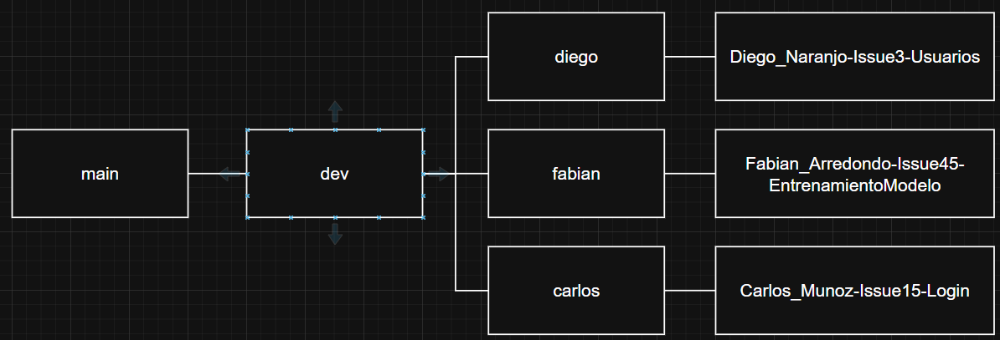

# Hiring Copilot

### Members:
- Diego Naranjo
- Heimy Alvarez
- Jefry Jimenez
- Nicholas Hemhauser
- Kevin Portilla
- Fabian Arredondo
- Carlos Muñoz
- Yordi Morales
- Astrid Jimenez
- Mayckel Porras

## Branches
Van a haber dos branches principales: main y dev.

La rama *main* va a ser la que estará ligada a los ambientes de producción y es la que tendrá el código desplegado en la nube. La idea es que aquí todos el código sea 100% funcional, ya testeado, tanto las pruebas unitarias de cada módulo, como manualmente en el proyecto involucrando la UI y el funcionamiento completo. 

La rama *dev* es la que estará antes de la main y donde se harán los testeos manuales que se mencionan en el punto anterior. Este punto del ciclo de vida del proyecto es donde se identificarán posibles bugs, se harán retrocesos de issues que necesitan ajustes, se harán pruebas y cualquier cosa que se pueda hacer previo a subir las cosas a main.

Cada uno va a tener una rama con su nombre. Esta rama se utilizará para hacer los merges a la rama dev. La idea es que, para cada issue que tengan asignado y que vayan completando, exista una rama relacionada a ese issue para que luego, esa rama, se haga merge con la rama que tiene su nombre, y esta se haga merge con la rama dev. 

Para el nombramiento de la rama, debe de seguir la siguiente estructura: Nombre_Apellido-ISSUE_NUMERO-MODULO

El siguiente diagrama explica visualmente cómo es que se estarán ordenando las ramas en el repositorio:

#### PULL REQUESTS
Cuando vayan a hacer un PR entre ramas, primero hagan merge de la rama del feature con su rama personal. Una vez tengan la rama personal actualizada, van a hacer merge con la rama dev. 

Para el merge con la rama dev, se van a necesitar aprobaciones. Para eso las personas designadas son: Diego y (definir otra persona). Hasta que todas las personas encargadas aprueben el PR, una de ellas va a hacer merge de la rama personal y dev. 

Cuando el proyecto esté en dev, se harán las pruebas necesarias para que todo funcione como debería de ser y una vez *grupalmente* se esté de acuerdo que ya el proyecto está funcional, una de las personas encargadas de hacer las aprobaciones hará merge con main y se publicará el proyecto.

## Backend Architecture

Backend/
│
├── Api/                        # Presentation layer / REST API
│   ├── Controllers/            # Controllers handling HTTP requests
│   │   ├── UsersController.cs           # Endpoints related to users
│   │   ├── CandidatesController.cs      # Endpoints for candidates
│   │   ├── JobDescriptionsController.cs # Endpoints for job postings
│   │   ├── ApplicationsController.cs    # Endpoints for applications
│   │   └── InterviewsController.cs      # Endpoints for interviews
│   │
│   ├── DTOs/                    # Data Transfer Objects
│   │   ├── UserDto.cs                 # User DTO
│   │   ├── CandidateDto.cs            # Candidate DTO
│   │   ├── JobDescriptionDto.cs       # Job posting DTO
│   │   └── ApplicationDto.cs          # Application DTO
│   │
│   ├── Middlewares/             # API middlewares
│   │   ├── AuthMiddleware.cs           # Authentication handling
│   │   └── ErrorHandlingMiddleware.cs  # Global error handling
│   │
│   └── Program.cs               # Application entry point, host and service configuration
│
├── Application/                 # Business logic / services layer
│   ├── Interfaces/             # Service contracts or interfaces
│   │   ├── IUserService.cs             # Definition of user-related methods
│   │   ├── ICandidateService.cs        # Methods for candidates
│   │   └── IJobDescriptionService.cs   # Methods for job postings
│   │
│   ├── Services/               # Service implementations
│   │   ├── UserService.cs               # Business logic for users
│   │   ├── CandidateService.cs          # Business logic for candidates
│   │   └── JobDescriptionService.cs     # Business logic for job postings
│   │
│   └── Validations/            # Business rule validations
│       └── Validators.cs               # Generic or specific validators
│
├── Domain/                     # Domain layer / business models
│   ├── Entities/               # Core application entities
│   │   ├── User.cs                     # User model
│   │   ├── Candidate.cs                # Candidate model
│   │   ├── JobDescription.cs           # Job posting model
│   │   ├── Application.cs              # Application model
│   │   └── Interview.cs                # Interview model
│   │
│   ├── Enums/                  # Domain enumerations
│   │   ├── UserRole.cs                  # User roles (Admin, Recruiter, etc.)
│   │   └── ApplicationStage.cs          # Application stages (Review, Interview, Rejected, etc.)
│   │
│   └── Common/                # Common or base classes
│       └── BaseEntity.cs               # Common entity properties (Id, CreatedAt, UpdatedAt)
│
├── Infrastructure/             # Infrastructure layer (data access, repositories, storage)
│   ├── Context/               # EF Core database context
│   │   └── AppDbContext.cs            # DB configuration and DbSets
│   │
│   ├── Config/                # Additional entity configurations
│   │   └── EntityConfigurations.cs    # Relationship, constraint, and mapping configuration
│   │
│   ├── Migrations/          # Database migrations (auto-generated by EF Core)
│   │
│   ├── Repositories/         # Repository pattern implementations
│   │   ├── UserRepository.cs           # CRUD for users
│   │   ├── CandidateRepository.cs      # CRUD for candidates
│   │   └── JobDescriptionRepository.cs # CRUD for job postings
│   │
│   └── Storage/              # File storage services
│       └── FileStorageService.cs      # File upload, download, and storage handling
│
├── Tests/                      # Unit and integration tests
│   ├── ApiTests/               # API layer tests
│   ├── ApplicationTests/       # Business logic tests
│   ├── DomainTests/            # Domain models and rules tests
│   └── InfrastructureTests/    # Data access and infrastructure tests
│
└── appsettings.json            # Application configuration file (DB connection, keys, etc.)

## Frontend Architecture

Frontend/
│
├── public/                      # Static assets
│   ├── infinite.logo.png       # Company logo
│   └── vite.svg                # Vite framework icon
│
├── src/                        # Main source code directory
│   ├── assets/                 # Application assets
│   │   └── react.svg          # React icon/logo
│   │
│   ├── auth/                   # Authentication & authorization
│   │   ├── AuthContext.tsx     # React Context for auth state management
│   │   ├── ProtectedRoute.tsx  # Route guard component for authenticated routes
│   │   └── types.ts           # Auth-related TypeScript types
│   │
│   ├── components/             # Reusable UI components
│   │   ├── CareersSection.tsx  # Job listings display section
│   │   ├── ConfirmModal.tsx    # Confirmation dialog component
│   │   ├── ContactSection.tsx  # Contact information section
│   │   ├── Footer.tsx          # Application footer
│   │   ├── HeroSection.tsx     # Landing page hero banner
│   │   ├── JobCard.tsx         # Individual job listing card
│   │   ├── Navbar.tsx          # Navigation bar with auth controls
│   │   └── UserModal.tsx       # User management modal
│   │
│   ├── hooks/                  # Custom React hooks
│   │   └── hooks.ts           # Placeholder for custom hooks
│   │
│   ├── pages/                  # Full page components (routes)
│   │   ├── admin/              # Admin-specific pages
│   │   │   ├── AdminLayout.tsx      # Admin panel layout with sidebar
│   │   │   └── UsersAdminPage.tsx   # User management page
│   │   ├── ApplyPage.tsx            # Job application form
│   │   ├── CareersPage.tsx          # Careers/jobs listing page
│   │   ├── HomePage.tsx             # Landing/home page
│   │   ├── HrCandidateDetailPage.tsx # Candidate profile view (HR)
│   │   ├── HrPage.tsx               # HR recruitment dashboard (Kanban)
│   │   ├── JobDetailPage.tsx        # Individual job posting detail
│   │   └── LoginPage.tsx            # User login page
│   │
│   ├── services/               # API service layer
│   │   └── services.ts        # Backend API calls
│   │
│   ├── types/                  # TypeScript type definitions
│   │   └── user.ts            # User interface definitions
│   │
│   ├── App.tsx                 # Main App component with routing
│   ├── App.css                 # App-level styles
│   ├── index.css               # Global styles
│   └── main.tsx                # React app entry point
│
├── package.json                # Project dependencies & scripts
├── tsconfig.json               # TypeScript configuration
├── vite.config.ts              # Vite bundler configuration
└── postcss.config.js           # PostCSS configuration (Tailwind)